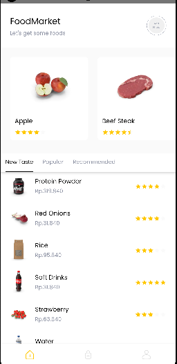
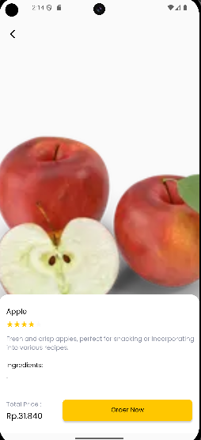
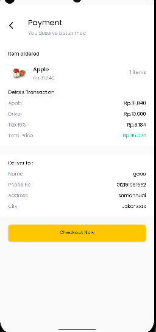
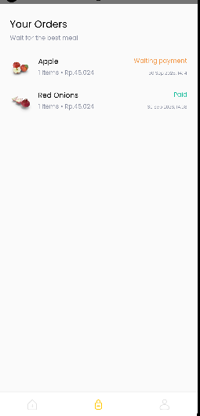
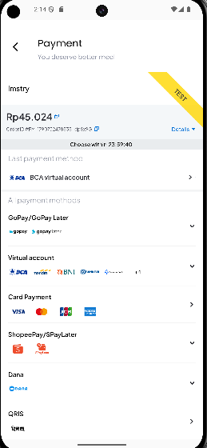
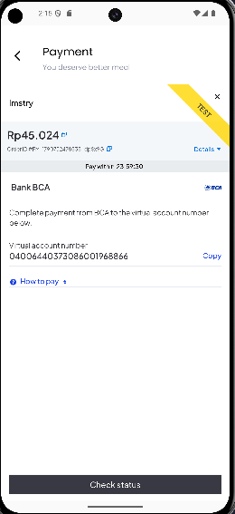
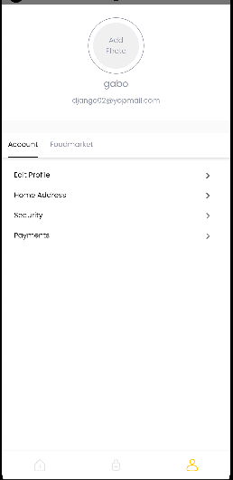

# FoodMarket — Food Ordering App (Native Android, Kotlin)

**FoodMarket** is a native Android app for ordering food and groceries. Users sign up with their address, browse food by category, see details and prices, then check out and pay through **Midtrans** (virtual account, e-wallet, card, QRIS and more). After paying, the order status updates **in real time** from *Waiting payment* to *Paid* without refreshing.

The app is written in **Kotlin** with the **MVVM** pattern, uses **Firebase** for authentication and user data, **Retrofit** for REST APIs, and a small **Vercel backend** that creates Midtrans transactions and receives payment notifications.

---

## Screenshots

| Home | Food Detail | Payment Summary | Your Orders |
|:---:|:---:|:---:|:---:|
|  |  |  |  |

| Midtrans Payment Methods | Virtual Account (BCA) | Profile |
|:---:|:---:|:---:|
|  |  |  |

---

## Features

### Authentication
- **Sign in and sign up** with email and password using **Firebase Authentication**
- Two-step sign up: account details with **profile photo** picked from the gallery, then **delivery address** (phone, address, house number, city)
- User profile saved in **Cloud Firestore**

### Home
- Horizontal list of featured food with photos and star ratings
- Three tabs: **New Taste**, **Popular** and **Recommended** (sorted by rating)
- Food data loaded from the [DummyJSON](https://dummyjson.com/) groceries API, with non-food items filtered out

### Food Detail
- Large food image, name, rating, description and ingredients
- Total price in Rupiah and an **Order Now** button

### Payment
- Payment summary with item, **driver fee**, **10% tax** and **total price**, plus the user's delivery details
- **Midtrans Snap** payment page opened inside the app (WebView), supporting virtual accounts (BCA, BNI, and others), GoPay, ShopeePay, DANA, credit/debit card and QRIS
- E-wallet and bank app links open the matching app on the device
- Final price is **calculated on the backend**, so it cannot be changed from the phone
- When Midtrans confirms the payment, the app automatically moves to the success screen

### Orders
- **Your Orders** list with status: *Waiting payment*, *Paid*, *Expired* or *Cancelled*
- Status updates **in real time** through a Firestore listener
- **Pull to refresh**

### Profile
- Profile photo, name and email
- **Account** tab: edit profile, home address, security and payments
- **Edit profile** and **delete account**
- **FoodMarket** tab: rate the app with **Google Play In-App Review**

---

## How the Payment Works

```
[App] Checkout Now
   │  POST /api/create-transaction  (productId, qty + Firebase login token)
   ▼
[Backend on Vercel] calculate price → save orders/{orderId} as PENDING → request Snap token from Midtrans
   │  returns orderId and redirectUrl
   ▼
[App] open redirectUrl (Midtrans Snap) in a WebView → user pays
   ▼
[Midtrans] sends notification → [Backend] /api/notification → orders/{orderId}.status = PAID
   ▼
[App] listens to Firestore orders/{orderId} → PAID → show success screen
```

The Midtrans **Server Key** is stored only on the backend, never in the app. A step-by-step setup guide is in [`docs/SETUP_MIDTRANS.md`](docs/SETUP_MIDTRANS.md).

---

## Architecture

The app follows **MVVM** (Model–View–ViewModel):

```
app/src/main/java/com/example/foodmarketkotlin/
├── data/
│   ├── model/       # request, response and UI models (Product, Order, CreateTransaction...)
│   ├── remote/      # Retrofit services: DummyJSON food API and the payment backend
│   └── repository/  # FoodRepository, PaymentRepository
├── viewModel/       # HomeViewModel, PaymentViewModel (StateFlow UI state)
├── ui/
│   ├── auth/        # sign in, sign up, sign up address, sign up success
│   ├── home/        # home + New Taste / Popular / Recommended tabs
│   ├── detail/      # food detail, payment, Midtrans payment, payment success
│   ├── order/       # order list
│   ├── profile/     # profile, account menu, FoodMarket menu, edit profile
│   └── splashscreen/
└── utils/           # price formatting, tax and total calculation, helpers
```

- **ViewModels** expose UI state (`Loading`, `Success`, `Error`) with **Kotlin StateFlow**
- **Repositories** call the APIs with **Coroutines** and return `Result` for clear success and error handling
- **Navigation Component** handles screen flow inside each activity (auth, main, detail)
- **View Binding** for type-safe access to views

---

## Libraries Used

| Library | Purpose |
|---|---|
| Kotlin + AndroidX (Core KTX, AppCompat, ConstraintLayout) | Base of the app |
| [Material Components](https://github.com/material-components/material-components-android) | UI components, bottom navigation, tabs |
| [Navigation Component](https://developer.android.com/guide/navigation) | Navigation between fragments |
| [Lifecycle ViewModel](https://developer.android.com/topic/libraries/architecture/viewmodel) | MVVM ViewModels |
| [Kotlin Coroutines](https://github.com/Kotlin/kotlinx.coroutines) | Asynchronous API calls |
| [Retrofit](https://square.github.io/retrofit/) + Gson | REST API client |
| [OkHttp](https://square.github.io/okhttp/) + Logging Interceptor | HTTP client and request logging |
| [Glide](https://github.com/bumptech/glide) | Loading food and profile images |
| [Firebase Authentication](https://firebase.google.com/docs/auth) | Email and password sign in / sign up |
| [Cloud Firestore](https://firebase.google.com/docs/firestore) | User profiles and real-time order status |
| [Firebase Analytics](https://firebase.google.com/docs/analytics) | App analytics |
| [Midtrans Snap](https://docs.midtrans.com/docs/snap-snap-integration-guide) | Payment gateway (via backend) |
| [Google Play In-App Review](https://developer.android.com/guide/playcore/in-app-review) | Rating the app without leaving it |
| SwipeRefreshLayout | Pull to refresh on the order list |

---

## Getting Started

**Requirements:** Android Studio (Jellyfish or newer), JDK 17, Android SDK 34, min SDK 24

```bash
# 1. Clone the repository
git clone https://github.com/EkoBudi14/kotlinFoodMarket.git
```

2. Open the project in Android Studio and let Gradle sync.
3. **Firebase:** create a Firebase project, enable **Email/Password** sign-in and **Cloud Firestore**, then put your own `google-services.json` in the `app/` folder.
4. **Backend (optional):** the app uses `https://foodmarket-backend-temporary.vercel.app/` by default. To use your own backend, add this line to `local.properties`:
   ```
   BACKEND_BASE_URL=https://your-project.vercel.app/
   ```
5. Run the app on an emulator or device.

**Testing a payment (Midtrans Sandbox):** choose *Credit/Debit Card* and use card `4811 1111 1111 1114`, expiry `12/30`, CVV `123`, OTP `112233`. For GoPay or QRIS use the [Midtrans Sandbox Simulator](https://simulator.sandbox.midtrans.com).

---

## Author

**Eko Budiarto** — Mobile Developer (Flutter & Android)
[GitHub](https://github.com/EkoBudi14) · [LinkedIn](https://www.linkedin.com/in/eko-budiarto-00/)
